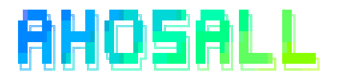

  

  Yoo! Im <b>Feh's/Ahosall</b>, sou apaixonado por tudo o que envolve programação ≧ ▽ ≦) 🤍.

<h2>
  🧾 | Sobre mim ...
</h2>

  Um pouco sobre mim heh ... (～ ≧ ∇ ≦) ～

<ul>
  <li> Tenho 16 anos. (sim, sou menor de idade ... ￣ へ ￣) </li>
  <li> Sou brasileiro ... 🇧🇷 </li>
  <li> Gosto de ouvir vários gêneros musicais ... (exceto K-pop e "Funk" 😜) </li>
  <li> Atualmente tenho 1,78-80 cm. 😏 </li>
  <li> Conheço programação desde os 11 anos ... 🤓👍 </li>
  <li> Eu também gosto muito de anime ~. (/ ≧ ▽ ≦) / </li>
</ul>

  Agora vou falar sobre o que sou bom ... ``￣︶￣)

<ul>
  <li>
    🐍 | Python - Comecei a estudar seriamente Python este ano. Mas como eu já conheci <b>JS</b>, então ... sou meio que bom nele heh.
  </li>
  <li>
    💻 | JavaScript - Eu estudo JavaScript desde os 14 anos, sempre gostei dessa linguagem, eu acho ela simplesmente maravilhosa, dá para fazer muuuitas coisas com ela hehe.
  </li>
  <li>
    🐧 | Shell Script - Sim, eu sei <b>Shell Script</b> (não, não é o post Shell hahah), conheci-o quando meu pai me apresentou ao Linux Ubuntu (um dos meus sistemas operacionais favoritos heh), gostei de ver código rodando na tela, mas eu odiava ter que escrever isso toda vez que eu queria instalá-lo no meu computador ou em outra pessoa haha ​​(sim, sou preguiçoso ... hahahahah).
  </li>
  <li>
    🐘 | PHP - hein? <b>PHP</b>? Meeee ... sim eu também sei <b>PHP</b> hahaha fiz algumas coisas com <b>PHP</b> (um projeto em MVC), mas não gostei muito, é muito legal você pode fazer muitas coisas. Com ele aprendi <b>MySQL</b> e como hospedar sites heh.
  </li>
  <li>
    📦 | MySQL - Como disse antes, conheci <b>MySQL</b> junto com <b>PHP</b> atualmente não me lembro muito bem, mas se estudar um pouco de novo devo lembrar de quase tudo. .. <code>SELECIONE y.HEART FROM YOU y</code> 😏🤍.
  </li>
  <li>
    📦 | MongoDB - Isso mesmo, eu conheço <b>MongoDB</b> heheh, conheci quando aprendi a fazer bots para o Discord, pensei que era bom para pequenos aplicativos ..
  </li>
</ul>
<blockquote>
  Tem muitas outras linguagens que se eu falar aqui vai virar uma biblía hahah, mas bom, sou grato a todas as pessoas que me ajudaram e ensinaram tudo isso heheh 🤍
</blockquote>
<h2>
  Github Analytics
</h2>

  Agora irei mostrar alguns gráficos sobre mim no GitHub.

  
  

  

    
     
    Pessoas acessaram meu perfil ≧w≦)
  
  

  

    Coded with 🤍by <a href="https://github.com/Ahosall">Ahosall (Feh's)</a>
  

  

    
    
  

